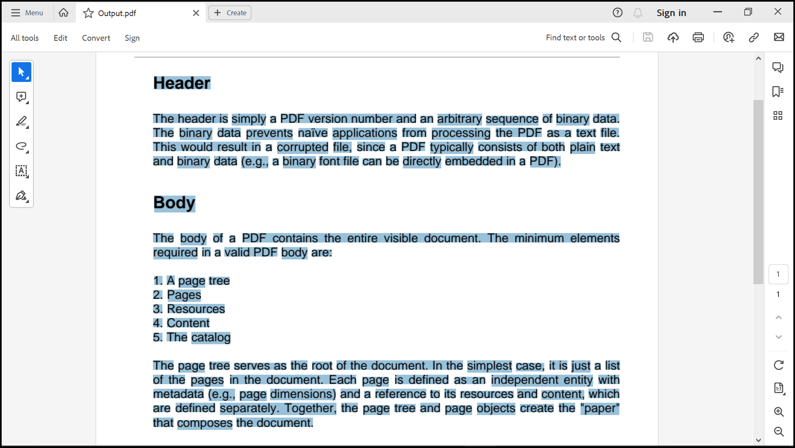
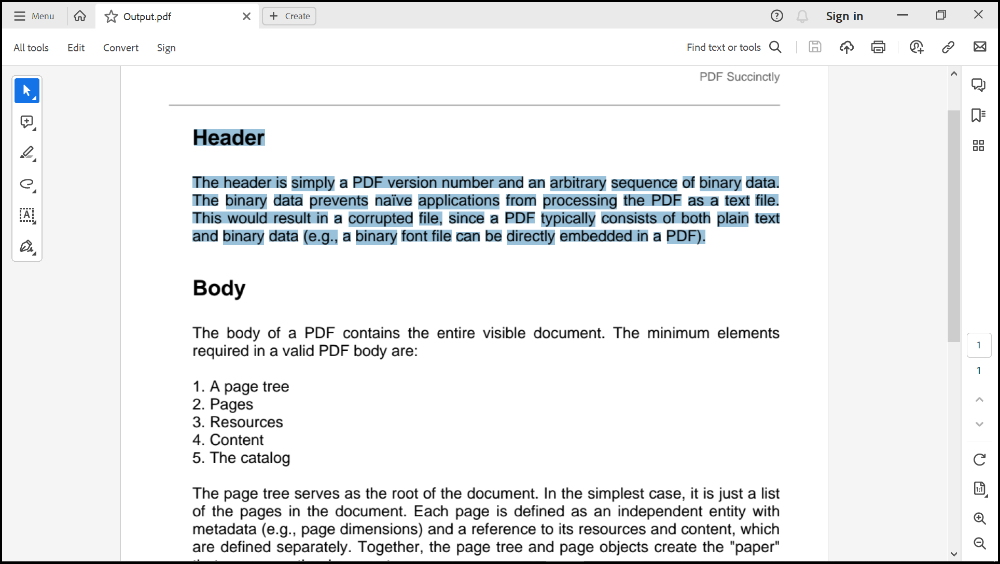
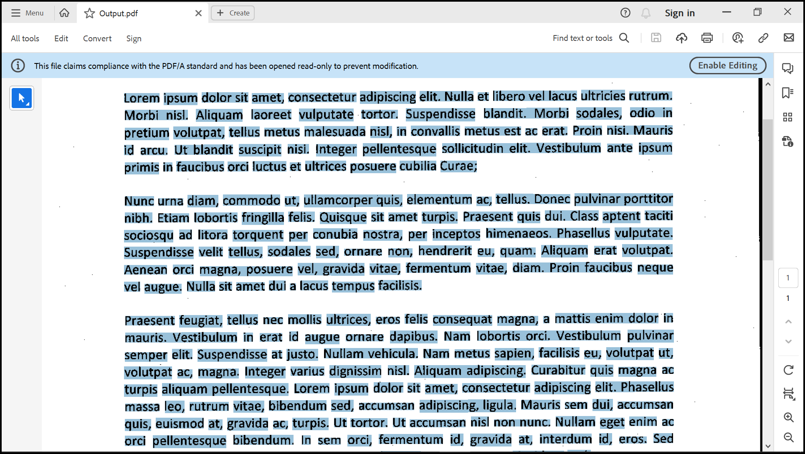
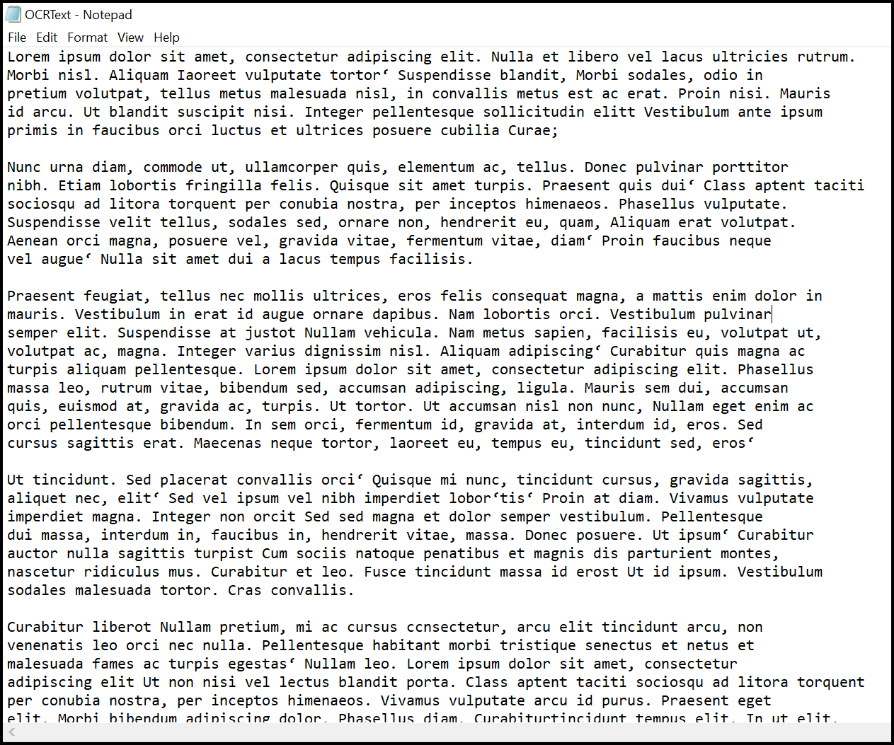

# How to Extract Text from Scanned PDFs in .NET using the Syncfusion&reg; OCR Library

## Introduction
A quick start .NET console project that shows how to extract text from scanned PDFs using the Syncfusion&reg; OCR Library.

## System requirement
**Framework and SDKs**
* .NET SDK (version 5.0 or later)

**IDEs**
*  Visual Studio 2019/ Visual Studio 2022

## Code snippet for Performing OCR on an entire PDF document
We will create a new .NET console application, add the Syncfusion&reg; OCR library package, and write the code

```csharp
//Initialize the OCR processor.
using (OCRProcessor processor = new OCRProcessor()) 
{
    //Get stream from an existing PDF document. 
    FileStream stream = new FileStream("Input.pdf", FileMode.Open);
    //Load the PDF document.
    PdfLoadedDocument loadedDocument = new PdfLoadedDocument(stream);
    //Set OCR language.
    processor.Settings.Language = Languages.English;                
    //Perform OCR with input document.
    processor.PerformOCR(loadedDocument);
    //Create file stream.
    using (FileStream outputFileStream = new FileStream("Output.pdf", FileMode.Create, FileAccess.ReadWrite)) {
        //Save the PDF document to file stream.
        loadedDocument.Save(outputFileStream);
    }
    //Close the document.
    loadedDocument.Close(true);
}
```

**Output Image**


## Code snippet for Performing OCR on a region of the document
We will create a new .NET console application, add the Syncfusion&reg; OCR library package, and write the code

```csharp
//Initialize the OCR processor.
using (OCRProcessor processor = new OCRProcessor()) {
    //Get stream from an existing PDF document. 
    FileStream stream = new FileStream("Input.pdf", FileMode.Open);
    //Load the PDF document.
    PdfLoadedDocument loadedDocument = new PdfLoadedDocument(stream);
    //Set OCR language.
    processor.Settings.Language = Languages.English;
    //Assign rectangles to the page.
    RectangleF rect = new RectangleF(0, 100, 950, 150);
    List<PageRegion> pageRegions = new List<PageRegion>();
    //Create page region.
    PageRegion region = new PageRegion();
    //Set page index.
    region.PageIndex = 0;
    //Set page regions.
    region.PageRegions = new RectangleF[] { rect };
    //Add region to page region.
    pageRegions.Add(region);
     //Set the regions.
    processor.Settings.Regions = pageRegions;
    //Perform OCR with input document.
    processor.PerformOCR(loadedDocument);
    //Create file stream.
    using (FileStream outputFileStream = new FileStream("Output.pdf", FileMode.Create, FileAccess.ReadWrite)) {
        //Save the PDF document to file stream.
        loadedDocument.Save(outputFileStream);
    }
    //Close the document.
    loadedDocument.Close(true);
}
```

**Output Image**


## Code snippet for OCR an image and convert to PDF
We will create a new .NET console application, add the Syncfusion&reg; OCR library package, and write the code

```csharp
//Initialize the OCR processor.
using (OCRProcessor processor = new OCRProcessor()) {
    //Get stream from an existing PDF document. 
    FileStream stream = new FileStream("Input.jpg", FileMode.Open);
    //Set OCR language.
    processor.Settings.Language = Languages.English;
    FileStream fontStream = new FileStream("ARIALUNI.ttf", FileMode.Open);
    //Set the unicode font. 
    processor.UnicodeFont = new PdfTrueTypeFont(fontStream, true, PdfFontStyle.Regular, 10);
    //Set the PDF conformance level.
    processor.Settings.Conformance = PdfConformanceLevel.Pdf_A1B;
    //Process OCR by providing the image.  
    PdfDocument document = processor.PerformOCR(stream);
    //Create file stream.
    using (FileStream outputFileStream = new FileStream("Output.pdf", FileMode.Create, FileAccess.ReadWrite)) {
        //Save the PDF document to file stream.
        document.Save(outputFileStream);
    }
    //Close the document.
    document.Close(true);
}
```

**Output Image**


## Code snippet for Performing OCR on image
We will create a new .NET console application, add the Syncfusion&reg; OCR library package, and write the code

```csharp
//Initialize the OCR processor.
using (OCRProcessor processor = new OCRProcessor()) {
    //Get stream from an existing PDF document. 
    FileStream stream = new FileStream("Input.jpg", FileMode.Open);
    //Set OCR language.
    processor.Settings.Language = Languages.English;
    //Perform the OCR process for an image steam.
    string OCRText = processor.PerformOCR(stream, processor.TessDataPath);
    //Write the OCR'ed text in text file. 
    using (StreamWriter writer = new StreamWriter("OCRText.txt", true)) {
        writer.WriteLine(OCRText);
    }
}
```

**Output Image**


## How to run the examples
* Download this project to a location in your disk. 
* Open the solution file using Visual Studio. 
* Rebuild the solution to install the required NuGet package. 
* Run the application.

## Resources
*   **Product page:** [Syncfusion&reg; PDF Framework](https://www.syncfusion.com/document-processing/pdf-framework/net)
*   **Documentation page:** [Syncfusion&reg; .NET PDF library](https://help.syncfusion.com/file-formats/pdf/overview)
*   **Online demo:** [Syncfusion&reg; .NET PDF library - Online demos](https://ej2.syncfusion.com/aspnetcore/PDF/CompressExistingPDF#/bootstrap5)
*   **Blog:** [Syncfusion&reg; .NET PDF library - Blog](https://www.syncfusion.com/blogs/category/pdf)
*   **Knowledge Base:** [Syncfusion&reg; .NET PDF library - Knowledge Base](https://www.syncfusion.com/kb/windowsforms/pdf)
*   **EBooks:** [Syncfusion&reg; .NET PDF library - EBooks](https://www.syncfusion.com/succinctly-free-ebooks)
*   **FAQ:** [Syncfusion&reg; .NET PDF library - FAQ](https://www.syncfusion.com/faq/)

## Support and feedback
*   For any other queries, reach our [Syncfusion&reg; support team](https://www.syncfusion.com/support/directtrac/incidents/newincident?utm_source=github&utm_medium=listing&utm_campaign=github-docio-examples) or post the queries through the [community forums](https://www.syncfusion.com/forums?utm_source=github&utm_medium=listing&utm_campaign=github-docio-examples).
*   Request new feature through [Syncfusion&reg; feedback portal](https://www.syncfusion.com/feedback?utm_source=github&utm_medium=listing&utm_campaign=github-docio-examples).

## License
This is a commercial product and requires a paid license for possession or use. Syncfusion’s licensed software, including this component, is subject to the terms and conditions of [Syncfusion's EULA](https://www.syncfusion.com/eula/es/?utm_source=github&utm_medium=listing&utm_campaign=github-docio-examples). You can purchase a licnense [here](https://www.syncfusion.com/sales/products?utm_source=github&utm_medium=listing&utm_campaign=github-docio-examples) or start a free 30-day trial [here](https://www.syncfusion.com/account/manage-trials/start-trials?utm_source=github&utm_medium=listing&utm_campaign=github-docio-examples).

## About Syncfusion&reg;
Founded in 2001 and headquartered in Research Triangle Park, N.C., Syncfusion&reg; has more than 26,000+ customers and more than 1 million users, including large financial institutions, Fortune 500 companies, and global IT consultancies.

Today, we provide 1600+ components and frameworks for web ([Blazor](https://www.syncfusion.com/blazor-components?utm_source=github&utm_medium=listing&utm_campaign=github-docio-examples), [ASP.NET Core](https://www.syncfusion.com/aspnet-core-ui-controls?utm_source=github&utm_medium=listing&utm_campaign=github-docio-examples), [ASP.NET MVC](https://www.syncfusion.com/aspnet-mvc-ui-controls?utm_source=github&utm_medium=listing&utm_campaign=github-docio-examples), [ASP.NET WebForms](https://www.syncfusion.com/jquery/aspnet-webforms-ui-controls?utm_source=github&utm_medium=listing&utm_campaign=github-docio-examples), [JavaScript](https://www.syncfusion.com/javascript-ui-controls?utm_source=github&utm_medium=listing&utm_campaign=github-docio-examples), [Angular](https://www.syncfusion.com/angular-ui-components?utm_source=github&utm_medium=listing&utm_campaign=github-docio-examples), [React](https://www.syncfusion.com/react-ui-components?utm_source=github&utm_medium=listing&utm_campaign=github-docio-examples), [Vue](https://www.syncfusion.com/vue-ui-components?utm_source=github&utm_medium=listing&utm_campaign=github-docio-examples), and [Flutter](https://www.syncfusion.com/flutter-widgets?utm_source=github&utm_medium=listing&utm_campaign=github-docio-examples)), mobile ([Xamarin](https://www.syncfusion.com/xamarin-ui-controls?utm_source=github&utm_medium=listing&utm_campaign=github-docio-examples), [Flutter](https://www.syncfusion.com/flutter-widgets?utm_source=github&utm_medium=listing&utm_campaign=github-docio-examples), [UWP](https://www.syncfusion.com/uwp-ui-controls?utm_source=github&utm_medium=listing&utm_campaign=github-docio-examples), and [JavaScript](https://www.syncfusion.com/javascript-ui-controls?utm_source=github&utm_medium=listing&utm_campaign=github-docio-examples)), and desktop development ([WinForms](https://www.syncfusion.com/winforms-ui-controls?utm_source=github&utm_medium=listing&utm_campaign=github-docio-examples), [WPF](https://www.syncfusion.com/wpf-ui-controls?utm_source=github&utm_medium=listing&utm_campaign=github-docio-examples), [WinUI(Preview)](https://www.syncfusion.com/winui-controls?utm_source=github&utm_medium=listing&utm_campaign=github-docio-examples), [Flutter](https://www.syncfusion.com/flutter-widgets?utm_source=github&utm_medium=listing&utm_campaign=github-docio-examples) and [UWP](https://www.syncfusion.com/uwp-ui-controls?utm_source=github&utm_medium=listing&utm_campaign=github-docio-examples)). We provide ready-to-deploy enterprise software for dashboards, reports, data integration, and big data processing. Many customers have saved millions in licensing fees by deploying our software.